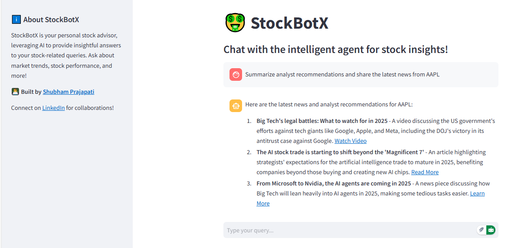

# StockBotX

## About The Project

StockBotX is an intelligent chatbot designed to provide insightful answers to your stock-related queries. It offers a user-friendly interface for market trends, stock performance, and financial insights.



## Table of Contents

- [Prerequisites](#prerequisites)
- [Getting Started](#getting-started)
- [Contributing](#contributing)
- [License](#license)
- [Contact](#contact)
- [Acknowledgements](#acknowledgements)

### Prerequisites

Before getting started, make sure you have the following:

- **GROQ API Key** (for stock-related data)
- **PHI API Key** (for additional stock market insights)

### Getting Started

To get started with this project locally, you’ll need Python 3.10+ installed on your machine along with the necessary Python packages. You can either clone the repository and install dependencies manually or use Docker for an isolated environment.

## Installation Steps

1. Clone the repository:

   - Open your terminal or command prompt.
   - Navigate to the directory where you want to install the project.
   - Run the following command to clone the GitHub repository:
     ```bash
     git clone https://github.com/shubhamprajapati7748/StockBotX
     ```

2. Create a Virtual Environment (Optional)

   - It's a good practice to create a virtual environment to manage project dependencies. Run the following command:
     ```bash
     conda create -p <Environment_Name> python==<python version> -y
     ```

3. Activate the Virtual Environment (Optional)

   - Activate the virtual environment based on your operating system:
     ```bash
     conda activate <Environment_Name>/
     ```

4. Install Dependencies

   - Navigate to the project directory:
     ```bash
     cd [project_directory]
     ```
   - Run the following command to install project dependencies:
     ```bash
     pip install -r requirements.txt
     ```

5. Create `.env` file and add your API keys

6. Run the Project

   ```bash
   streamlit run app.py
   ```

7. Access the Project
   - Visit `http://localhost:8501` in your browser to use the app.

## Contributing

Contributions to the Google Gemini-Pro Chat Application are welcome! If you have suggestions, enhancements, or bug fixes, please follow the steps below:

1. Fork the project.
2. Create your feature branch (`git checkout -b feature/YourFeature`).
3. Commit your changes (`git commit -m 'Add some feature'`).
4. Push to the branch (`git push origin feature/YourFeature`).
5. Open a pull request.

## License

Distributed under the MIT License. See `LICENSE.txt` for more information.

## Contact

- Shubham Prajapati - [shubhamprajapati7748@gmail.com](mailto:shubhamprajapati7748@gmail.com)

## Acknowledgement

- **PHIDATA** for providing stock data.
- **Groq** for powering the AI models.
